<div align="center">

# 🍻 Pub Quiz Scoring System

**Run a pub quiz that looks like a TV game show.**<br>
Score from your laptop, watch the leaderboard race, confetti and all, on the big screen.

[](https://github.com/MarkusWernerBaumgartner/PubQuizLeaderboard/actions/workflows/ci.yml)
[](CHANGELOG.md)
[](LICENSE)


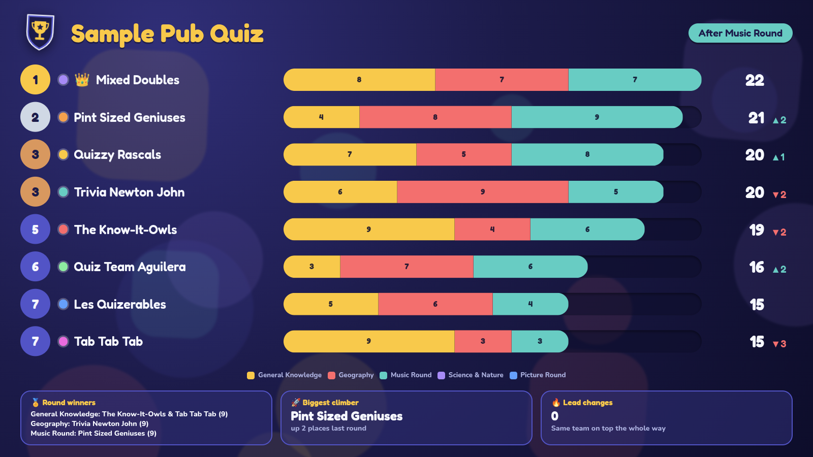

</div>

---

## ✨ What it does

### 🏁 A leaderboard that actually races
Type a score on your laptop and the big screen reacts instantly: bars stretch, totals count up, teams swap places, and a 👑 moves to the new leader, with confetti when the lead changes.

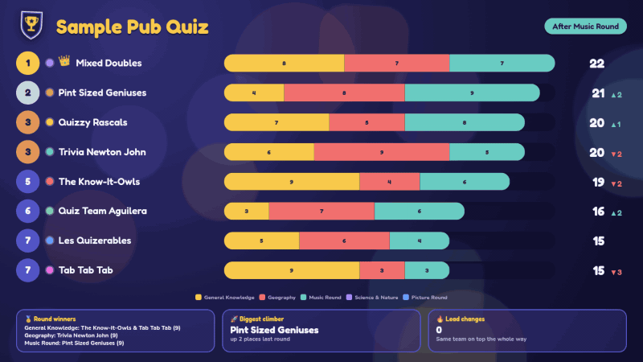

### 🧠 Questions, like a slideshow
Add questions with four options per round, then click through them from Admin: **board → question → question + options → board → …** The scoreboard slides aside to make room, and **Reveal answer** lights up the right one.

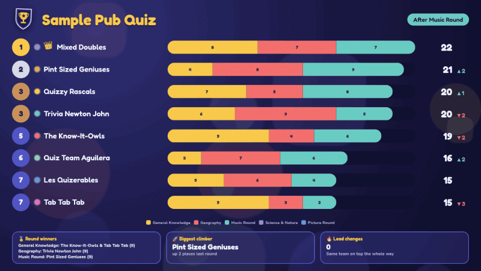

### 📜 Rules that read themselves out
Start the night with an animated rules screen (fully editable), then flip a switch to reveal the scoreboard.

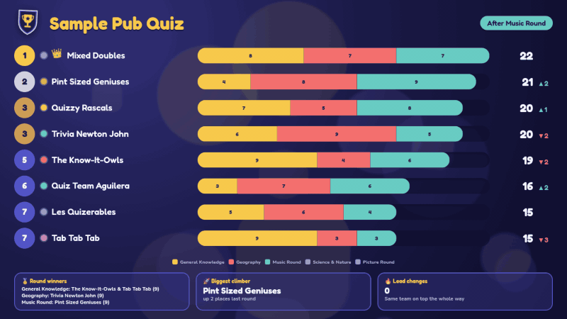

### 🎨 Make it yours in 30 seconds
Your name, your logo, your colours, your window icon: all from the **Branding** tab, applied live to every screen. Save the result as a preset and swap identities for different events.

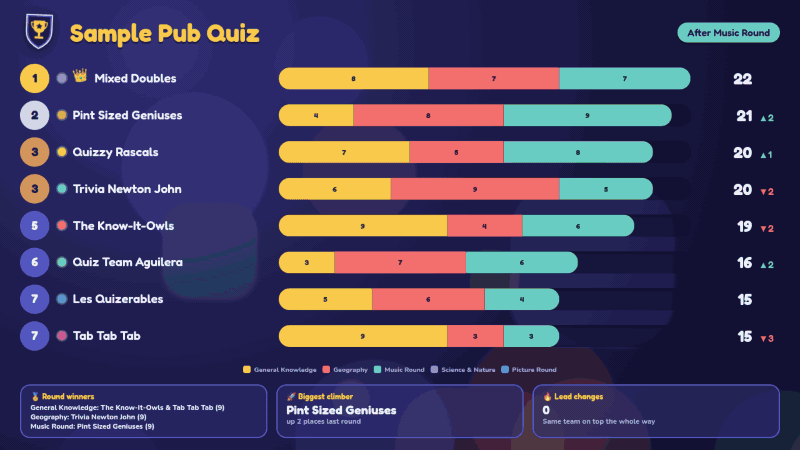

### 🛟 Built so you can't lose the night
Every score is saved the instant you type it, so closing the window or pulling the plug loses nothing. Optionally autosave to a file of your choice (a USB stick, a synced folder), with a live status chip so you can see it working.

---

## 🖥️ Three windows, one app

| Launcher | Admin |
| :---: | :---: |
| 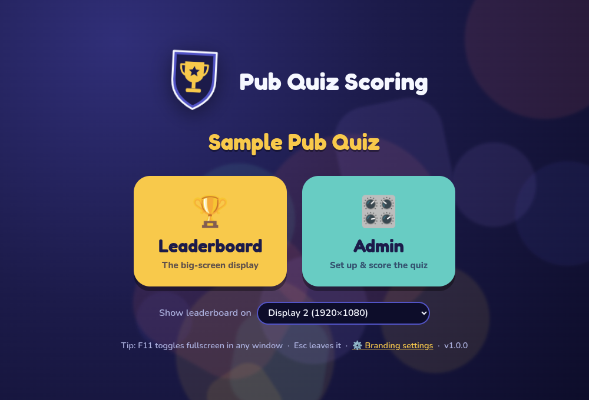 | 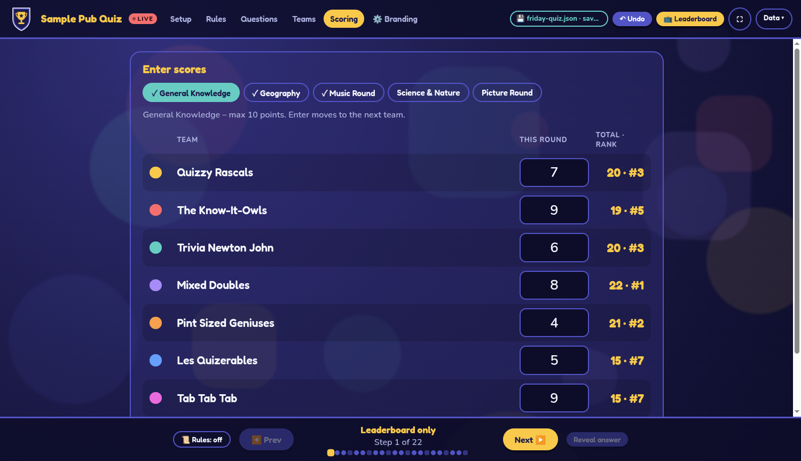 |
| Pick the big-screen **Leaderboard** or the **Admin** panel. The leaderboard can open fullscreen on the projector. | Set up rounds, rules, questions and teams, then enter scores. **Enter** jumps to the next team; **Undo** has your back. |

<details>
<summary><b>More screenshots</b></summary>
<br>

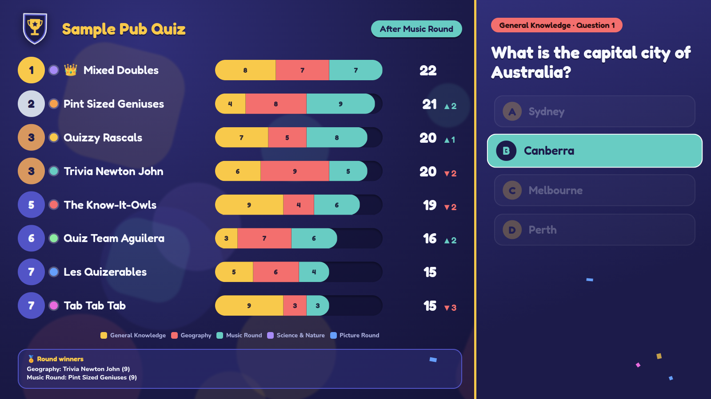
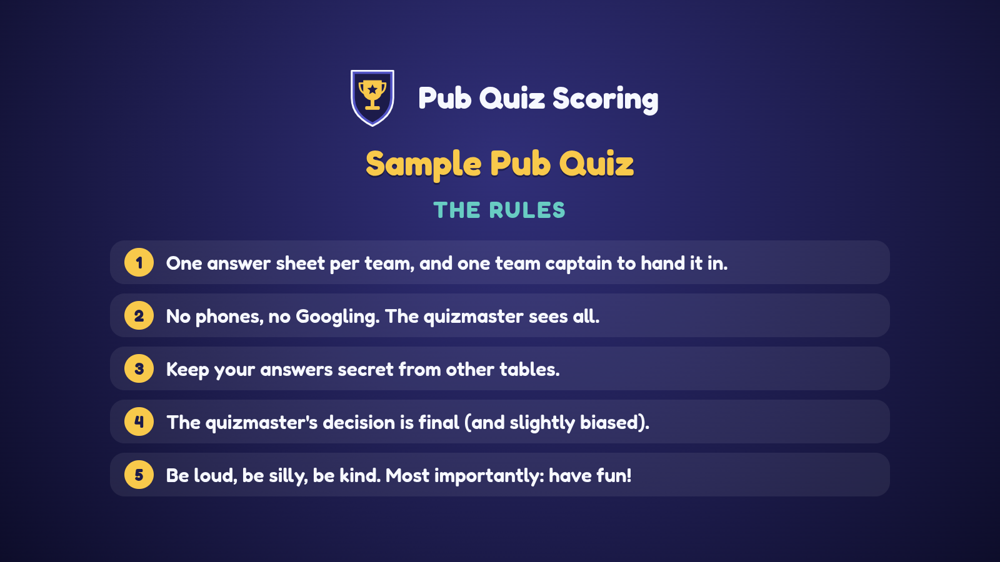
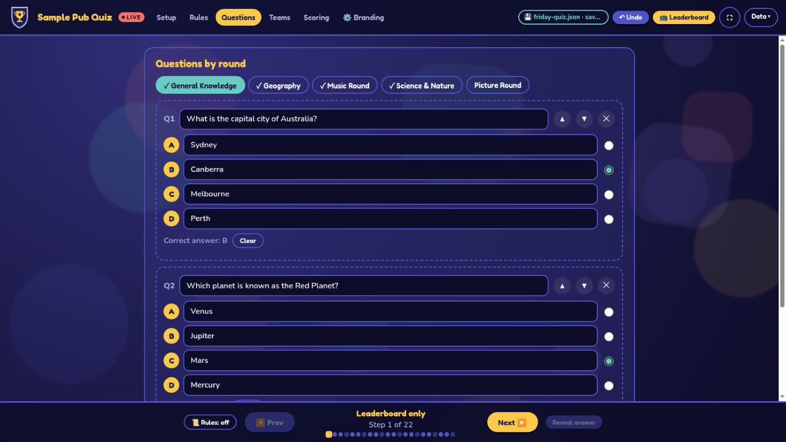
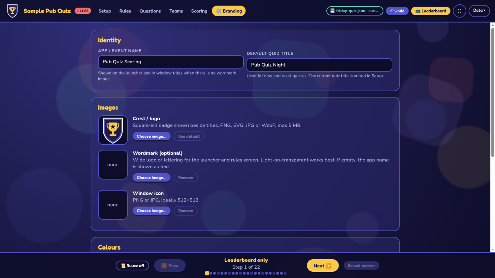

</details>

## 🚀 Quick start

**Download:** grab the latest AppImage from the [Releases](https://github.com/MarkusWernerBaumgartner/PubQuizLeaderboard/releases) page, make it executable and run it:

```bash
chmod +x PubQuizScoring-*.AppImage
./PubQuizScoring-*.AppImage
```

**Or run from source** (Node.js 20+):

```bash
git clone https://github.com/MarkusWernerBaumgartner/PubQuizLeaderboard.git
cd PubQuizLeaderboard
npm install
npm start
```

### Try it in 60 seconds
1. Launch the app → **Admin** → **Data → Load quiz…** → choose `examples/sample-quiz.json`.
2. Launch the **Leaderboard** (drag it to your second screen and press **F11** for fullscreen).
3. In Admin → **Scoring**, pick *Science & Nature* and type some scores. Watch the screen. 🎉
4. Use **Next ▶** at the bottom to step through the questions.

## 📚 Documentation

| | |
| --- | --- |
| 📖 [User guide](docs/user-guide.md) | Run a quiz night, step by step |
| 🎨 [Branding](docs/branding.md) | Colours, logos, presets |
| 🏗️ [Architecture](docs/architecture.md) | How it's built |
| 🛠️ [Development](docs/development.md) | Tests, CI, regenerating these GIFs, releases |
| 📝 [Changelog](CHANGELOG.md) | What changed in each version |

## 🧰 Under the hood

Electron with plain HTML/CSS/JS (no framework, no bundler). All game logic is a small pure module with a full unit-test suite, and CI runs the real app headlessly, including a test that kills it mid-quiz and checks that nothing was lost. Everything stays on your machine in `~/.config/pubquiz-scoring/`; there's no server, account or network access.

```bash
npm test          # unit tests
npm run verify    # what CI runs: tests + version + hygiene checks
npm run dist      # build the AppImage
npm run media     # regenerate the screenshots & GIFs above
```

Contributions are welcome: see [CONTRIBUTING.md](CONTRIBUTING.md).

## 📄 Licence

MIT, see [LICENSE](LICENSE). Bundled fonts (Fredoka, Nunito) are under the SIL Open Font Licence; texts in `src/renderer/assets/fonts/`.
