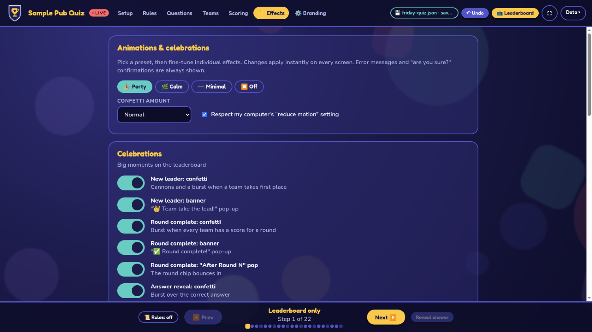

# Animations, celebrations & popups

Everything that moves, pops up or celebrates can be switched off. Open **Admin → ✨ Effects**. Changes apply instantly on every screen, and the settings are stored per computer (see [Where it is stored](#where-it-is-stored)).

## Presets

| Preset | What you get |
| --- | --- |
| 🎉 **Party** (default) | Everything on |
| 🌿 **Calm** | No confetti, banners, pulses, "+N" points or background motion. Keeps bars, sliding re-order, count-up numbers, and the question/rules animations |
| ➖ **Minimal** | Only count-up numbers, sliding re-order, growing bars and the question panel |
| ⏹ **Off** | Everything instant and static |

Edit any single switch afterwards and the preset shows as 🎛 **Custom**. A **confetti amount** setting (Low / Normal / Lots) scales every confetti burst, and **Reset to defaults** returns to Party.

**Respect my computer's "reduce motion" setting** (on by default): if your operating system asks for reduced motion, the app behaves like *Minimal* regardless of your switches. Untick it to always use your own settings.

The **Preview** buttons under *Celebrations* play the new-leader, round-complete and answer-reveal effects on the Leaderboard window using your current switches, so you can hear how loud a setting is before the night starts.

## Every effect

Information is never lost when an effect is off: rank arrows, final totals, the revealed answer and the rules text all still appear, just without the motion.

### Celebrations (Leaderboard)

| Switch | Trigger | What it does |
| --- | --- | --- |
| New leader: confetti | A different team takes sole first place | Two corner cannons and a central burst |
| New leader: banner | same | "👑 Team take the lead!" pop-up for about 3 seconds |
| Round complete: confetti | Every team has a score for a round | A burst from the top of the screen |
| Round complete: banner | same | "✅ Round complete!" pop-up |
| Round complete: "After Round N" pop | same | The round chip bounces in |
| Answer reveal: confetti | You press *Reveal answer* | A burst over the correct answer |
| Answer reveal: pop animation | same | The correct option bounces (it still turns green and the others still dim) |
| Penalty / bonus: banner | You give a team penalty or bonus points (Scoring tab) | Banner naming the team, the points and the reason |
| Penalty: screen shake | A penalty is given | The scoreboard shakes |
| Bonus: confetti | A bonus is given | A burst from the top of the screen |

### Score updates (Leaderboard)

| Switch | What it does |
| --- | --- |
| Pulse the changed team | The team's total flashes and its bar glows |
| Floating "+N" points | Points float up from the team's row |
| Count-up numbers | Totals tick up instead of jumping |
| Sliding re-order | Teams slide to their new places instead of jumping |
| Growing bars | Bars and round segments animate their width |

### Screens & transitions

| Switch | What it does |
| --- | --- |
| Rules appear one by one | Each rule slides in; off shows them all at once |
| Question panel slides in | The panel, question text and options animate in |
| Stats cards animate | Cards pop in as they rotate every nine seconds |
| Launcher intro | Logo, title and buttons pop in when the app starts |

### Ambient decoration

| Switch | What it does |
| --- | --- |
| Drifting background shapes | Slowly moving coloured blobs on every screen |
| Wobbling crest | The logo sways on the launcher and leaderboard header |
| Bobbing leader crown | The 👑 beside the leading team |
| Bobbing "waiting for teams" icon | The 🍻 shown before any team is added |

### Admin window

| Switch | What it does |
| --- | --- |
| Interface motion | Tab fade-in, dialog rise, input shake on a rejected value (the red outline stays), blinking LIVE dot, switch slide |
| Success messages | Confirmations such as "Quiz loaded" or "Scores cleared" |

### Always on

These are not switchable because they protect your data or report problems: **error messages** (for example "Could not save to …") and **confirmation dialogs** (removing a team or round, loading a file, clearing scores, resetting).

## Where it is stored

Per computer, next to your [branding](branding.md), in `settings.json` in the app's data folder (see the table in the [user guide](user-guide.md#saving-and-loading)). It is separate from quiz files, so loading a quiz or choosing *Reset everything* never changes your effect preferences.

## For developers

Effects are defined in one place, `src/shared/effects.js`. A switch is honoured either in CSS, through an `html.fx-off-<name>` rule (the flag `scores.reorder` becomes `fx-off-scores-reorder`), or in JavaScript with `Effects.on('flag.name')`. A unit test fails if a flag is defined but nothing in the renderer uses it, so a switch can never silently do nothing. To add an effect: add the flag (with a label and hint) to `FLAGS`, gate it, and decide which presets include it.
